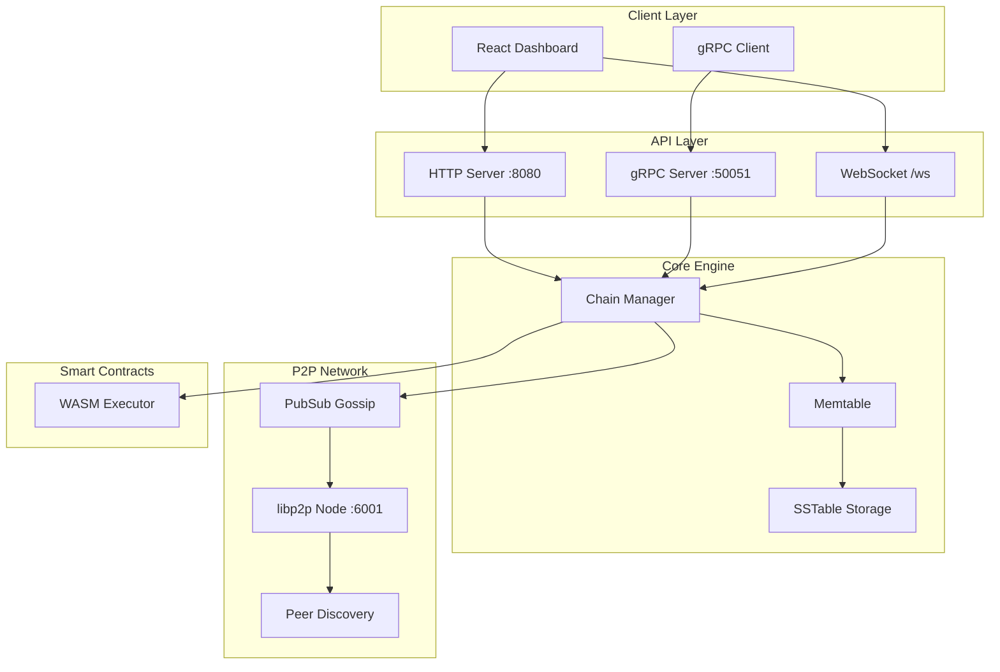

# Aether-Chain

A high-performance blockchain and distributed data availability layer built in Go. Features P2P networking, gRPC/HTTP APIs, WebAssembly smart contract execution, and a real-time React dashboard.

## Architecture



## Features

- **LSM-Tree Storage Engine** - Memory-efficient key-value storage with SSTable persistence
- **P2P Networking** - Decentralized peer discovery and block propagation via libp2p
- **Dual API Support** - gRPC for high-performance clients, HTTP/WebSocket for web apps
- **WASM Smart Contracts** - Execute validation logic via WebAssembly
- **Real-time Dashboard** - Live block explorer with WebSocket updates
- **Multi-node Docker Setup** - Run a local cluster with docker-compose

## Quick Start

### Prerequisites
- Go 1.24+
- Node.js 20+ (for dashboard)
- Docker & Docker Compose (optional)

### Run Locally

```bash
# Build the node
make build

# Start the node
./aetherd start --port 6001 --data ./data

# Or run with Docker
make docker-up
```

### Access Points
| Service | URL |
|---------|-----|
| Dashboard | http://localhost:8080 |
| HTTP API | http://localhost:8080/api |
| WebSocket | ws://localhost:8080/ws |
| gRPC | localhost:50051 |

## API Endpoints

### HTTP
- `GET /api/status` - Node status
- `GET /api/blocks` - List all blocks

### gRPC
- `SubmitData(key, value)` - Write data to chain

## Tech Stack

| Component | Technology |
|-----------|------------|
| Backend | Go 1.24 |
| P2P | libp2p |
| RPC | gRPC + Protobuf |
| Smart Contracts | Wazero (WASM) |
| Frontend | React + Vite + TailwindCSS |
| Containerization | Docker |

## Project Structure

```
aether-chain/
├── cmd/aetherd/       # CLI entry point
├── api/               # HTTP, gRPC, WebSocket servers
├── core/
│   ├── engine/        # Chain manager, Memtable, SSTable
│   ├── block/         # Block structure
│   └── vm/            # WASM executor
├── p2p/               # libp2p networking
├── proto/             # Protobuf definitions
├── storage/           # Virtual filesystem
└── dashboard/         # React frontend
```

## License

MIT
