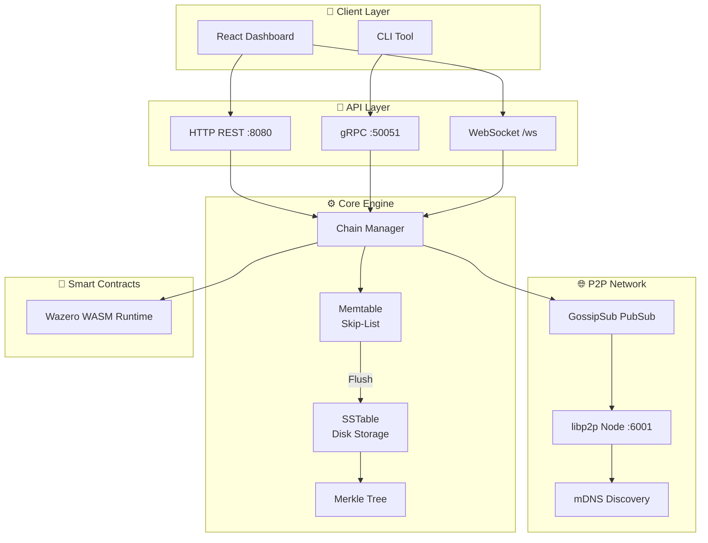

# Aether-Chain

> A high-performance distributed data availability layer combining **LSM-Tree storage** with **blockchain immutability** and **P2P networking**.

[](https://go.dev/)
[](https://react.dev/)
[](https://docker.com/)
[](LICENSE)

## 🌟 Features

- **LSM-Tree Storage** - Memory-efficient key-value storage with Skip-List memtable and SSTable persistence
- **Blockchain Integrity** - SHA-256 hash chaining with Merkle Tree per block
- **P2P Networking** - Decentralized node discovery via libp2p (mDNS + GossipSub)
- **WASM Smart Contracts** - Sandboxed validation logic using Wazero runtime
- **Real-time Dashboard** - Interactive block explorer with WebSocket live updates
- **Multi-node Cluster** - Run 3-node testnet locally with Docker Compose

## 🏗️ Architecture



## 🚀 Quick Start

### Prerequisites
- Go 1.24+
- Node.js 20+ (for dashboard)
- Docker & Docker Compose

### Run with Docker (Recommended)

```bash
# Start 3-node cluster
docker-compose up --build

# Access dashboard
open http://localhost:8081
```

### Run Locally

```bash
# Build
make build

# Start node
./aetherd start --port 6001 --data ./data
```

## 🖥️ Dashboard

The interactive dashboard lets you:

| Feature | Description |
|---------|-------------|
| **Generate Blocks** | Run benchmark to create blocks via LSM-Tree |
| **Write Data** | Store custom data in memtable |
| **Verify Chain** | Check blockchain integrity |
| **View Peers** | See P2P network status |
| **Block Explorer** | Browse all blocks with details |
| **Architecture View** | Visualize system layers |

## 🔌 API Endpoints

### HTTP REST
| Endpoint | Method | Description |
|----------|--------|-------------|
| `/api/status` | GET | Node status & metrics |
| `/api/blocks` | GET | List all blocks |
| `/api/bench` | POST | Run benchmark |
| `/api/write?value=data` | POST | Write to memtable |
| `/api/memtable` | GET | Memtable info |
| `/api/peers` | GET | P2P peers |
| `/api/merkle` | GET | Merkle tree structure |
| `/api/verify` | GET | Verify chain integrity |
| `/api/arch` | GET | Architecture info |

### WebSocket
- `ws://localhost:8080/ws` - Real-time block notifications

### gRPC
- `SubmitData(key, value)` - Write data to chain

## 🛠️ Tech Stack

| Layer | Technology |
|-------|------------|
| **Language** | Go 1.24 |
| **Storage** | LSM-Tree (Skip-List + SSTable + mmap) |
| **Networking** | libp2p, gRPC, WebSocket |
| **Smart Contracts** | Wazero (WebAssembly) |
| **Frontend** | React 19, Vite, TailwindCSS |
| **Infrastructure** | Docker, Docker Compose |

## 📁 Project Structure

```
aether-chain/
├── cmd/aetherd/       # CLI entry point
├── api/               # HTTP, gRPC, WebSocket servers
├── core/
│   ├── engine/        # Chain manager, Memtable, SSTable
│   ├── block/         # Block structure
│   └── vm/            # WASM executor
├── p2p/               # libp2p networking
├── proto/             # Protobuf definitions
├── storage/           # Virtual filesystem
├── dashboard/         # React frontend
├── Dockerfile         # Multi-stage build
└── docker-compose.yml # 3-node cluster config
```

## 📝 How It Works

1. **Write** → Data enters Memtable (RAM, Skip-List)
2. **Flush** → When full (~10KB), flush to SSTable (Disk)
3. **Block** → SSTable becomes immutable block with hash chain
4. **Verify** → Merkle Tree ensures data integrity
5. **Propagate** → New blocks broadcast to peers via GossipSub

## 📄 License

MIT License - see [LICENSE](LICENSE)

---

**Made with ❤️ by [JullMol](https://github.com/JullMol)**
